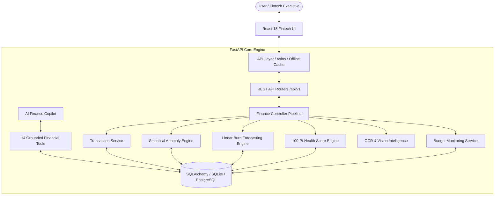
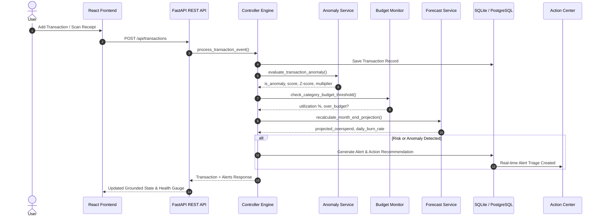

# Finote AI — Intelligent Finance Controller
## System Architecture & Technical Specifications

Finote AI is engineered for the **Razorpay AI Builder Internship 2026 — Track 4: AI Finance Controller**.

Unlike traditional expense trackers that simply record what happened, Finote AI operates on the signature controller loop:

$$\text{Observe} \longrightarrow \text{Understand} \longrightarrow \text{Detect} \longrightarrow \text{Predict} \longrightarrow \text{Recommend} \longrightarrow \text{Act}$$

---

## 1. High-Level Architecture Diagram

---

## 2. The Proactive Finance Controller Pipeline

Every time a transaction is recorded, updated, or scanned from a receipt, it triggers the automated Controller Event Loop:

---

## 3. Core Intelligence Modules

### A. Statistical Anomaly Detection Engine
- **Methodology**: Evaluates incoming transaction amounts against the user's category-specific historical distribution.
- Computes **Mean**, **Median**, **Standard Deviation**, and **Interquartile Range (IQR)**:
  $$\text{IQR} = Q_{75} - Q_{25}$$
  $$\text{Upper Bound} = Q_{75} + 1.5 \times \text{IQR}$$
  $$Z = \frac{x - \mu}{\sigma}$$
- Flags spending anomalies with normalized scores (0 to 100) and human-readable comparative reasons (e.g. *"3.9x higher than your median Shopping spend"*).

### B. Linear Burn Rate Forecasting Engine
- **Methodology**: Grounded Linear Burn Rate model calculated across active calendar days:
  $$\text{Daily Burn Rate} = \frac{\text{Current Month Spending}}{\text{Days Elapsed}}$$
  $$\text{Projected Monthly Spend} = \text{Current Spending} + (\text{Daily Burn Rate} \times \text{Days Remaining})$$
  $$\text{Projected Overspend} = \max(0, \text{Projected Monthly Spend} - \text{Monthly Income})$$
- Generates category-level overrun warnings and provides confidence ratings (*High*, *Moderate*, *Preliminary*).

### C. Deterministic 100-Point Financial Health Score
- Six transparent, reproducible weighted dimensions:
  1. **Budget Adherence (30%)**: Category utilization vs set limits
  2. **Savings Rate (25%)**: Savings vs 50/30/20 benchmark
  3. **Spending Volatility (15%)**: Daily burn rate vs optimal pacing
  4. **Recurring Expense Load (10%)**: Fixed overhead vs net income
  5. **Anomaly Index (10%)**: Frequency of unreviewed outliers
  6. **Forecast Buffer (10%)**: Projected month-end surplus or deficit

### D. Grounded AI Tool-Calling Copilot
- Connects LLM (Gemini / OpenAI API or deterministic fallback) directly to 14 structured tools:
  - `get_monthly_summary()`
  - `get_category_spending(category)`
  - `get_budget_status(category)`
  - `get_transactions(limit, category, type, search)`
  - `get_transaction_details(transaction_id)`
  - `get_forecast()`
  - `get_financial_health()`
  - `get_anomalies()`
  - `get_recurring_expenses()`
  - `get_top_merchants()`
  - `get_income()`
  - `get_expenses()`
  - `create_financial_alert(title, message, severity, category)`

### E. Receipt Intelligence & OCR
- Multi-step receipt extraction pipeline parsing merchant name, date, subtotal, GST/tax, and itemized lines.
- Pre-save interactive verification screen allowing user confirmation before ledger insertion.
